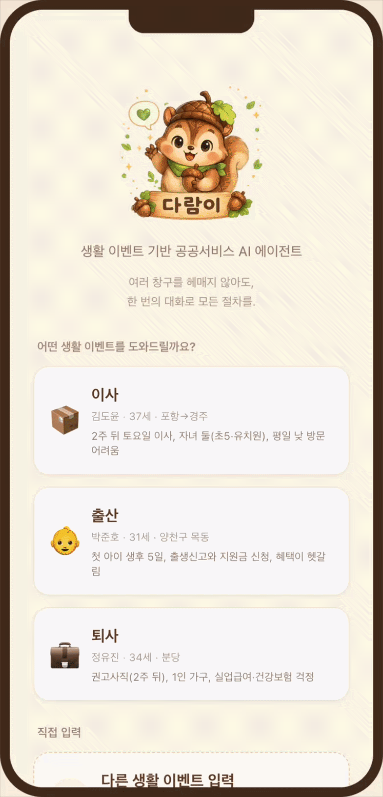
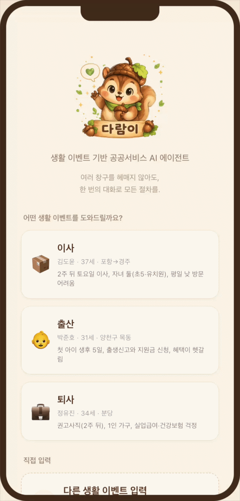
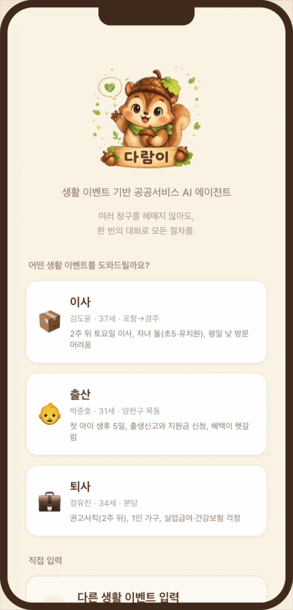

<div align="center">


# 다람이

### 생활 이벤트 기반 공공서비스 AI 에이전트

이사·출산·퇴사 같은 **생활 이벤트**를 말하면, AI가 흩어진 행정 절차를 대신 모아
**“언제까지 · 어디서 · 무엇을”** 해야 하는지 태스크 보드로 정리해 주는 모바일 웹앱.

[기능](#-주요-기능) · [예시 시나리오](#-예시-시나리오) · [실행 방법](#-실행-방법)

</div>

---

## 🌰 한눈에 보기

공공서비스는 정보가 부처·지자체·법령에 흩어져 있어, 막상 무엇을 챙겨야 할지 알기 어렵습니다.
**다람이**는 사용자가 자기 상황을 평소 말투로 이야기하면,

1. **대화형 AI**(Upstage Solar Pro)가 맥락을 파악하고
2. 필요한 행정 절차만 골라 **태스크 보드**에 실시간으로 채워 주며
3. 각 절차의 **기한·기관·구비서류·법적 근거**를 실제 공공 API로 검증해 보여 줍니다.

> “대화로 묻고 → 보드로 정리받는” 챗봇 + 할 일 보드 하이브리드 경험을 모바일 UI로 제공합니다.

---

## ✨ 주요 기능

| 기능 | 설명 |
|---|---|
| 💬 **대화형 상담** | 생활 이벤트를 자연어로 설명하면 Solar Pro가 맥락을 이해하고 필요한 절차만 안내 |
| 🗂️ **실시간 태스크 보드** | 대화 중 확정된 절차가 “할 일” 보드에 자동으로 추가됨 (`🌰 할 일에 N개 추가됨 · 보기 →`) |
| ✅ **다중 선택 빠른답변** | 해당하는 항목을 체크리스트로 한 번에 골라 응답 |
| 🛡️ **실데이터 검증 (grounding)** | 기한·기관·서류·출처를 실제 공공 API로 교차검증하고, 검증 여부를 정직하게 표기 |
| 🧠 **세션 페르소나 + 충돌 검증** | 대화에서 사용자 사실(facts)을 추출·기억하고, 모순되는 정보는 되물어 정확성 확보 |
| ➕ **동적 플레이북 생성** | 미리 정의되지 않은 이벤트(상속·결혼·창업 등)도 자유 입력하면 즉석에서 안내 생성 |
| 💾 **세션 영속** | 대화·보드·페르소나가 이벤트별로 저장되어, 다시 들어와도 이전 상태 그대로 복원 |

<details>
<summary><b>실데이터 grounding이 연결된 공공 API</b></summary>

- **국가법령정보 OPEN API** — 근거 조문·법정기한·시행일·소관부처 교차검증
- **보조금24 (gov24/v3)** — 중앙·지자체·거주지 동적 복지의 기관·구비서류·신청기한·출처
- **중앙부처복지서비스 (복지로)** — 보조금24에 없는 중앙 복지(부모급여 등)

절차마다 `verified / partial / unverified` 상태를 부여해 **🛡️ 공식 출처 검증됨 / ℹ️ 자동 검증 전**으로
표시하고, grounding되지 않은 정보는 보드에 띄우지 않습니다.

</details>

---

## 🎬 예시 시나리오

현재 데모에는 **3종의 사전 정의(predefined) 시나리오**가 준비되어 있습니다.
각 시나리오는 사용자가 평소 말투로 던지는 한 문장에서 시작합니다.

<table>
<tr>
<th width="33%" align="center">📦 이사</th>
<th width="33%" align="center">👶 출산</th>
<th width="33%" align="center">💼 퇴사</th>
</tr>
<tr>
<td align="center"><sub>김도윤 · 37세 · 포항→경주</sub></td>
<td align="center"><sub>박준호 · 31세 · 서울 양천구</sub></td>
<td align="center"><sub>정유진 · 34세 · 분당</sub></td>
</tr>
<tr>
<td valign="top"><sub>“포항에서 경주로 2주 뒤 토요일에 이사 가요. 평일 낮엔 시간 내기 어렵고, 첫째는 초5·둘째는 유치원이에요. 뭘 준비해야 하나요?”</sub></td>
<td valign="top"><sub>“첫 아이가 5일 전에 태어났어요. 서울 양천구 목동에 살아요. 출생신고랑 지원금을 챙기고 싶은데 중앙·서울시·구청 혜택이 섞여서 헷갈려요.”</sub></td>
<td valign="top"><sub>“회사 사정으로 2주 뒤 권고사직하게 됐어요. 분당에 혼자 살고 3년 4개월 일했어요. 실업급여·건강보험이 어떻게 되는지 걱정돼요.”</sub></td>
</tr>
<tr>
<td align="center"></td>
<td align="center"></td>
<td align="center"></td>
</tr>
</table>

---

## 🚀 실행 방법

### 1) 백엔드 (포트 8000)

```bash
cd backend
python3 -m venv .venv && source .venv/bin/activate
pip install -r requirements.txt
cp .env.example .env   # UPSTAGE_API_KEY, LAW_OC, DATA_GO_KR_KEY 입력
uvicorn main:app --reload --port 8000
```

### 2) 프론트엔드 (포트 5173)

```bash
cd frontend
npm install
npm run dev
```

브라우저에서 **http://localhost:5173** 접속 — `/api` 요청은 Vite가 백엔드(:8000)로 프록시합니다.
데모 자동 시작: `http://localhost:5173/?go=move` (`move` · `birth` · `resignation`).

---

## 🧩 API 엔드포인트

| 메서드 | 경로 | 설명 |
|---|---|---|
| `GET`  | `/api/health` | 상태·모델·키 보유 여부 |
| `GET`  | `/api/playbook/{event}?region=` | 실데이터 grounding된 플레이북 (region=거주 시도) |
| `GET`  | `/api/legal-basis/{procedure_id}` | 절차의 법적 근거 실시간 조회 |
| `POST` | `/api/persona` | 입력·선택에서 사용자 페르소나(facts) 갱신 + 충돌 검사 |
| `POST` | `/api/generate` | 자유 입력 → 동적 플레이북 생성 |
| `POST` | `/api/chat` | 대화 (SSE 스트리밍) — 페르소나·플레이북 함께 전송 |

### Solar Pro 연동

선별된 플레이북을 시스템 프롬프트에 주입하면, **Upstage Solar Pro2**(`solar-pro2`)가
대화 답변과 보드 갱신 정보를 JSON으로 응답합니다.

---

<div align="center">
<sub>🌰 다람이 — 흩어진 공공서비스를, 한 번의 대화로.</sub>
</div>
